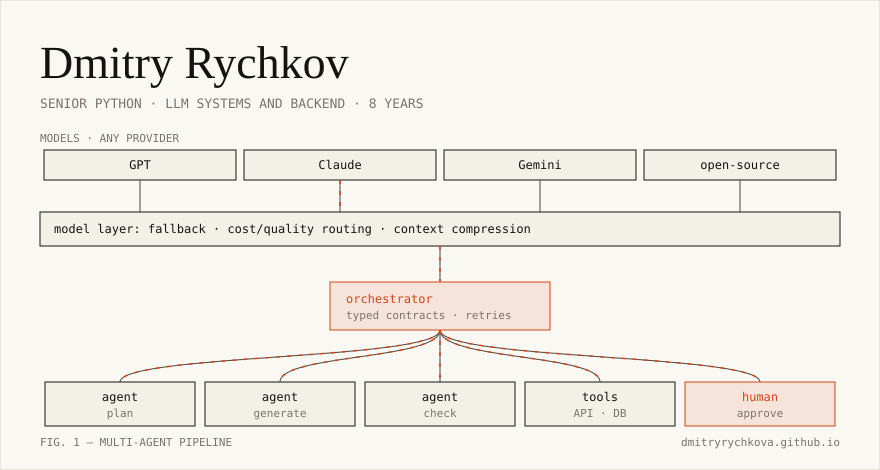

<picture>
  <source media="(prefers-color-scheme: dark)" srcset="assets/orchestration-dark.svg">
  
</picture>

Senior Python engineer, **8 years in commercial software development**. I design and build multi-agent LLM systems and the backend that runs them.

### What I do

- **LLM systems.** Multi-agent orchestration, several providers behind one layer, fallback, cost/quality routing, context compression.
- **Backend.** FastAPI and Django, PostgreSQL, task queues on ARQ and Celery over Redis and RabbitMQ, observability with Prometheus and Loki.
- **ML.** DICOM medical image processing pipelines, inference services, Qt desktop apps for clinics.

### Projects

- **Multi-agent LLM system** (under NDA). Designed and wrote the whole backend: a layer over model providers, an orchestrator with typed contracts, human approval points. Tech lead for the frontend team.
- **Medical imaging** (since 2020). DICOM pipelines and inference services in production, Qt/QML desktop apps for clinics.
- **Open code.** [fastapi-clean-architecture](https://github.com/DmitryRychkovA/fastapi-clean-architecture): a reference FastAPI service with Clean Architecture layers, RabbitMQ workers, Redis, Alembic migrations, tests and CI.

### Tools

Python · FastAPI · Django · SQLAlchemy 2.0 · PostgreSQL · Redis · ARQ · Celery · RabbitMQ · pytest · Docker  
multi-agent systems · MCP · OpenAI · Anthropic · Gemini · LangChain · Pydantic · ONNX · OpenCV

---

[dmitryrychkova.github.io](https://dmitryrychkova.github.io) · Telegram [@dmitry_dtr](https://t.me/dmitry_dtr) · [dmitry.rychkov.a@gmail.com](mailto:dmitry.rychkov.a@gmail.com)
